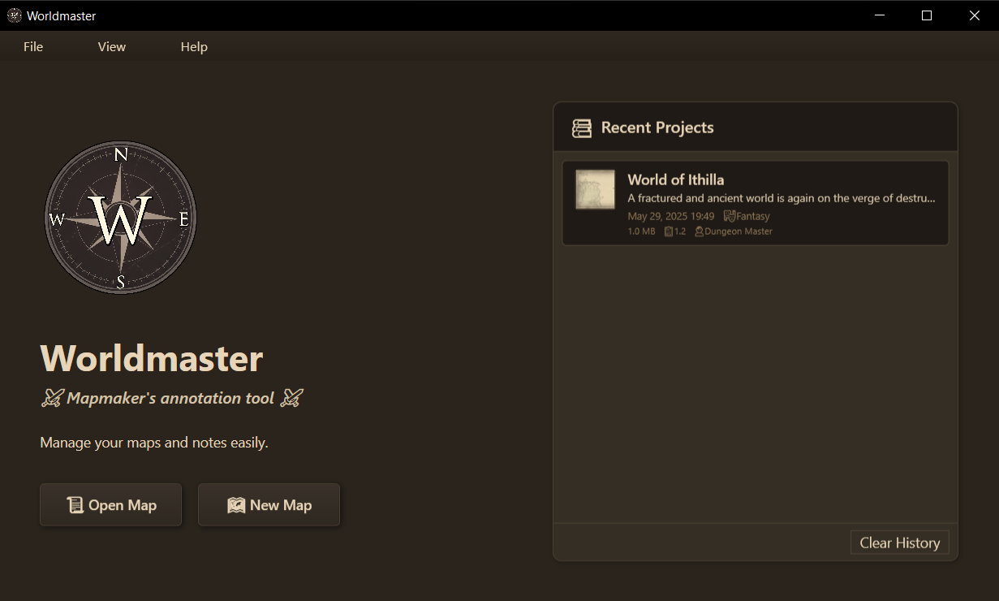
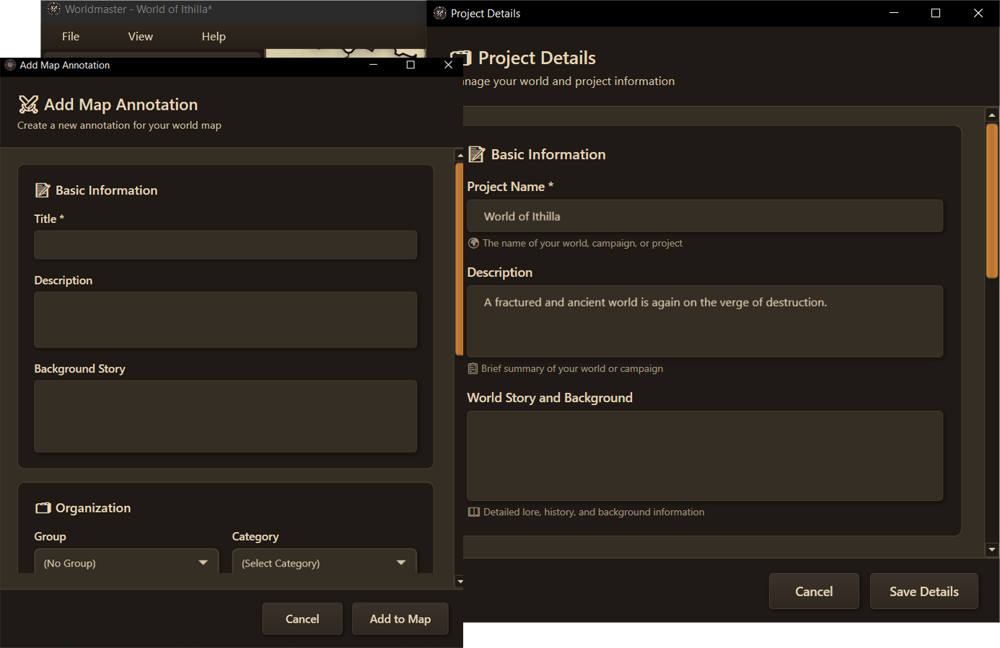
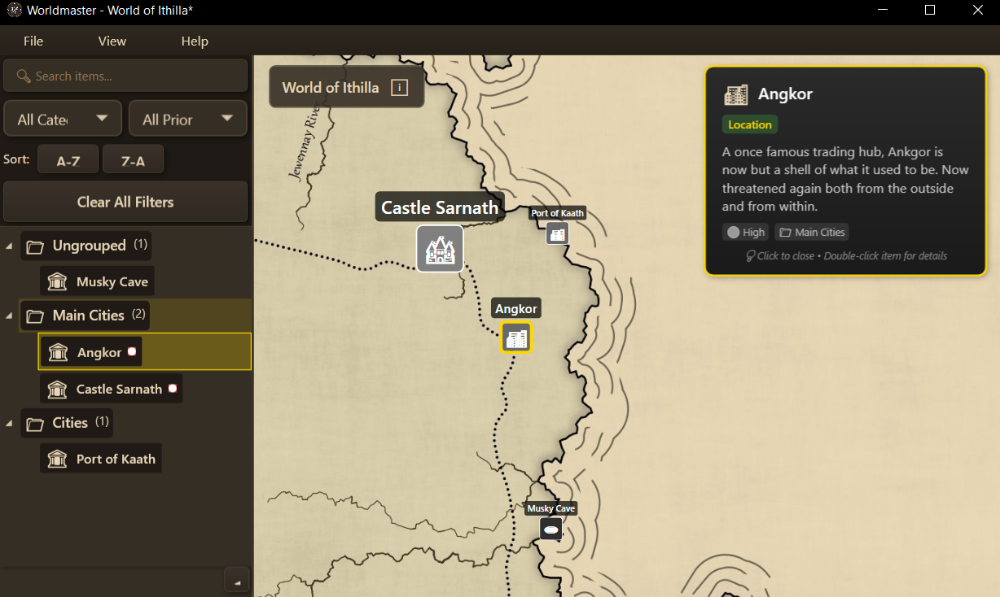
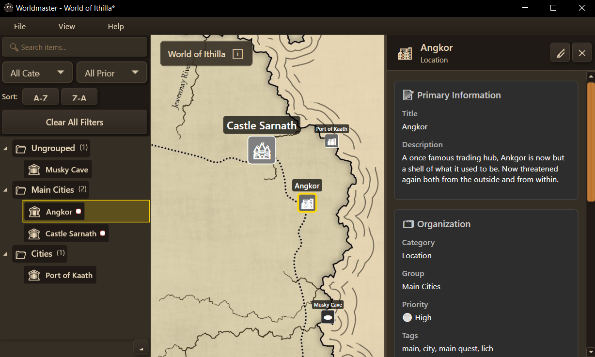

# Worldmaster

A desktop application for world-building and campaign management with a dark cartography-inspired interface.

## Features

- **Project Management**: Create and organize world-building projects with detailed metadata
- **Item Catalog**: Manage locations, characters, items, and lore with rich descriptions
- **Search & Filter**: Find content quickly with search and sorting capabilities
- **Rich Editor**: Add detailed descriptions, tags, and categorization
- **Dark Theme**: Cartography-inspired dark interface optimized for long sessions
- **Sidebar Navigation**: Collapsible sidebar for efficient workspace management

## Screenshots

### Welcome Screen

### Main Interface

### Map View with Tooltips

### Detailed Item View

## Usage

1. **Create a Project**: Start by creating a new world-building project
2. **Add Items**: Use the interface to add locations, characters, items, and lore
3. **Organize**: Use tags, categories, and groups to organize your content
4. **Search**: Use the search functionality to quickly find specific items
5. **Edit**: Double-click items or use the edit button to modify details

## Download

Download the latest release from the [Releases](https://github.com/razvanbackpack/worldmaster-releases/releases) page.

## System Requirements

- Windows 10/11
- 4GB RAM recommended
- No additional software needed (self-contained)

## License

[Add your license here]

